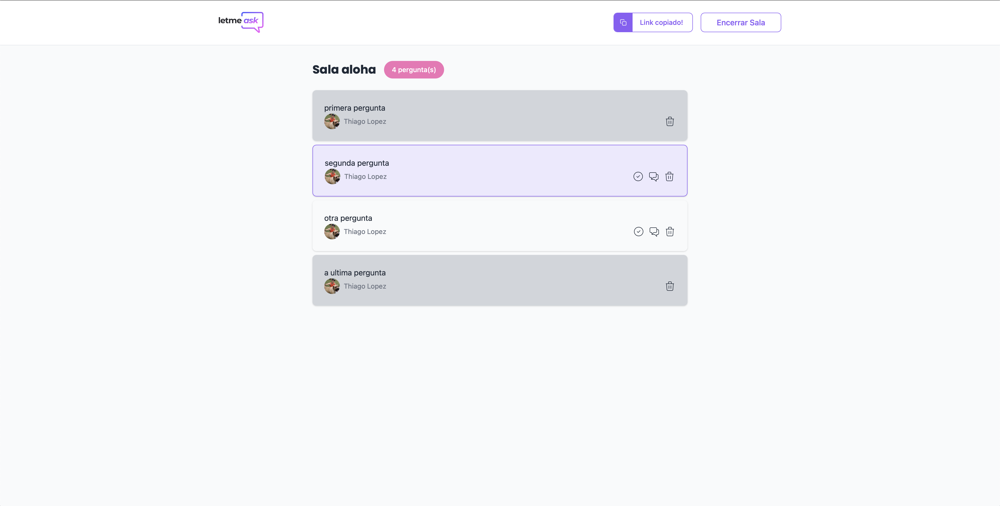
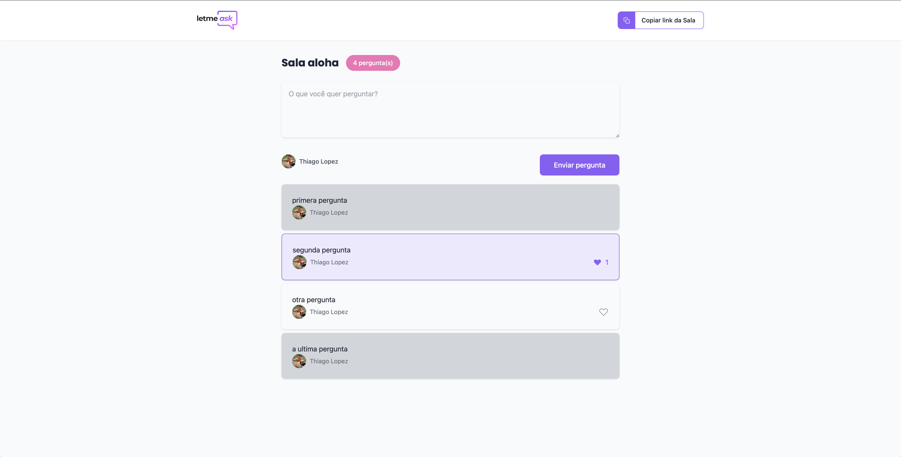
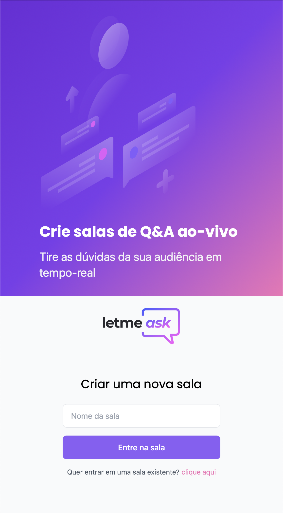
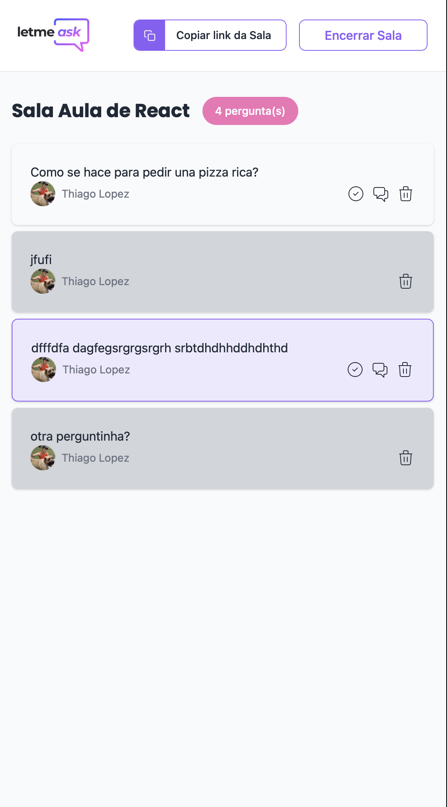
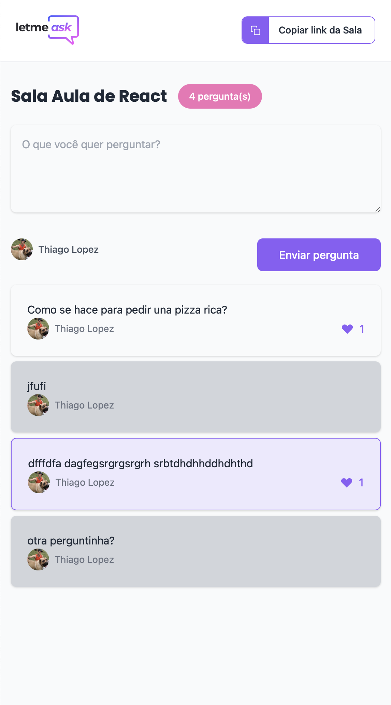

[![Contributors][contributors-shield]][contributors-url]
[![Forks][forks-shield]][forks-url]
[![Stargazers][stars-shield]][stars-url]
[![Issues][issues-shield]][issues-url]
[![MIT License][license-shield]][license-url]

<!-- PROJECT LOGO -->
 

  

  <h3 align="center">NLW-letmeask</h3>

  

   projeto da NLW 6 2021
     
    <a href="https://letmeask-f2395.web.app">View Demo</a>
    ·
    <a href="https://github.com/thiagocr2017/NLW-letmeask/issues">Report Bug</a>
    ·
    <a href="https://github.com/thiagocr2017/NLW-letmeask/issues">Request Feature</a>
  

<!-- TABLE OF CONTENTS -->

  
Indice

  <ol>
    <li>
      <a href="#letmeask">Letmeask</a>
      <ul>
        <li><a href="#inicio">Inicio</a></li>
        <li><a href="#sala-admin">Sala Admin</a></li>
        <li><a href="#sala-cliente">Sala Cliente</a></li>
        <li><a href="#mobile">Mobile</a></li>
        <li><a href="#built-with">Construção</a></li>
      </ul>
    </li>
    <li><a href="#license">License</a></li>
    <li><a href="#contact">Contact</a></li>
    <li><a href="#acknowledgements">Acknowledgements</a></li>
  </ol>

<!-- Letmeask -->
# Letmeask

Uma ferramenta criada para solucionar entre os comunicadores e sua audiencia, a forma em que eles interactuam nas lives de redes sociales o en cursos a distancia, podendo organizar o fluxo de informação das perguntas e respostas em tempo real.

### Inicio

<ul>
 
 
 
</ul>

### Sala Admin

<ul>
  
</ul>

### Sala Cliente

<ul>
  
</ul>

### Mobile

<ul>
  
  
  
  
</ul>

### Built With

Ferramentas que ajudaram no desenvolvimento:
* [React](https://reactjs.org)
* [Tailwind CSS](http://tailwindcss.com)
* [Firebase](https://firebase.google.com)

<!-- LICENSE -->
## License

Distributed under the MIT License. See `LICENSE` for more information.

<!-- CONTACT -->
## Contact

Thiago Lopez Alfaro - [Whatsapp](https://api.whatsapp.com/send?phone=+5575992151972&text=vi%20seu%20perfil%20em%20github%20gostaria%20de%20falar%20sobre) - lopezalfaro@icloud.com

Project Link: [https://github.com/thiagocr2017/NLW-letmeask](https://github.com/thiagocr2017/NLW-letmeask)

<!-- ACKNOWLEDGEMENTS -->
## Acknowledgements
* [GitHub Emoji Cheat Sheet](https://www.webpagefx.com/tools/emoji-cheat-sheet)
* [Img Shields](https://shields.io)
* [Choose an Open Source License](https://choosealicense.com)
* [GitHub Pages](https://pages.github.com)
* [Animate.css](https://daneden.github.io/animate.css)
* [Loaders.css](https://connoratherton.com/loaders)
* [Slick Carousel](https://kenwheeler.github.io/slick)
* [Smooth Scroll](https://github.com/cferdinandi/smooth-scroll)
* [Sticky Kit](http://leafo.net/sticky-kit)
* [JVectorMap](http://jvectormap.com)
* [Font Awesome](https://fontawesome.com)

<!-- MARKDOWN LINKS & IMAGES -->
<!-- https://www.markdownguide.org/basic-syntax/#reference-style-links -->
[contributors-url]: https://github.com/thiagocr2017/NLW-letmeask/graphs/contributors
[forks-url]: https://github.com/thiagocr2017/NLW-letmeask/network/members
[stars-url]: https://github.com/thiagocr2017/NLW-letmeask/stargazers
[issues-url]: https://github.com/thiagocr2017/NLW-letmeask/issues
[license-url]: https://github.com/thiagocr2017/NLW-letmeask/blob/master/LICENSE.txt

[contributors-shield]: https://img.shields.io/github/contributors/thiagocr2017/NLW-letmeask?style=for-the-badge
[forks-shield]: https://img.shields.io/github/forks/thiagocr2017/NLW-letmeask?style=for-the-badge
[stars-shield]: https://img.shields.io/github/stars/thiagocr2017/NLW-letmeask?style=for-the-badge
[issues-shield]: https://img.shields.io/github/issues/thiagocr2017/NLW-letmeask?style=for-the-badge
[license-shield]: https://img.shields.io/github/license/othneildrew/Best-README-Template.svg?style=for-the-badge
